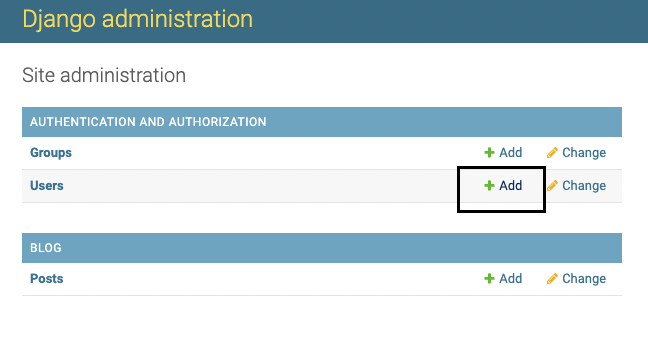
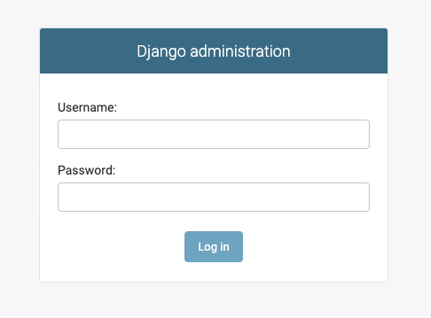
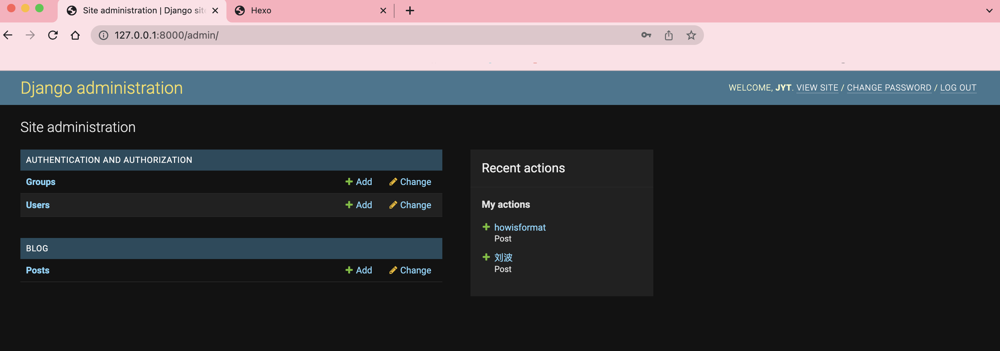
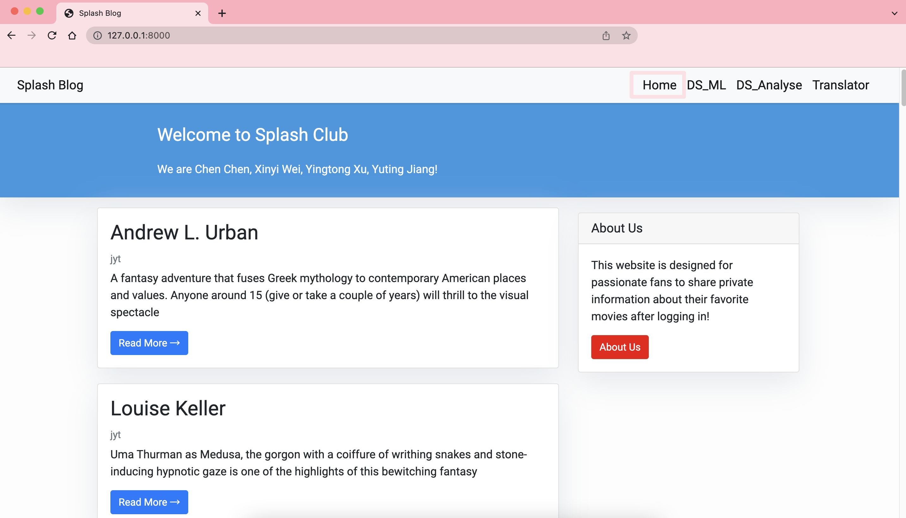
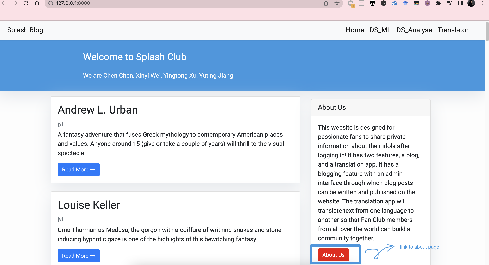
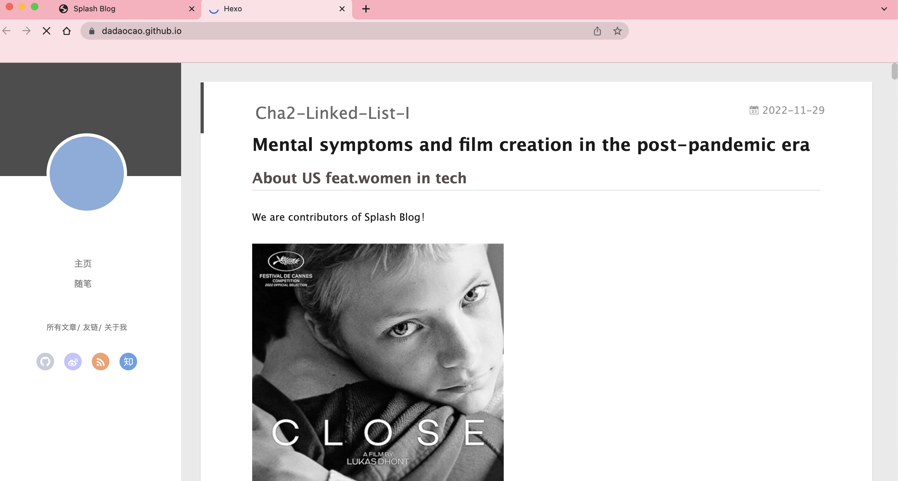
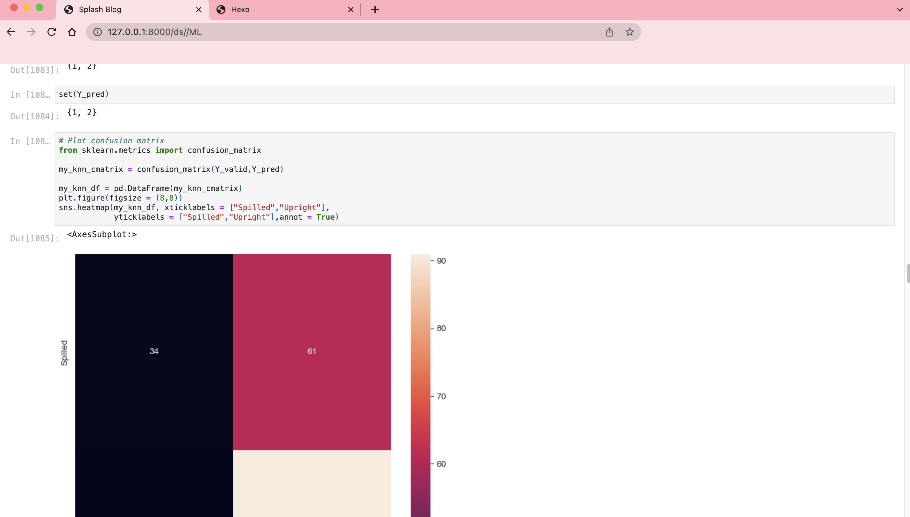
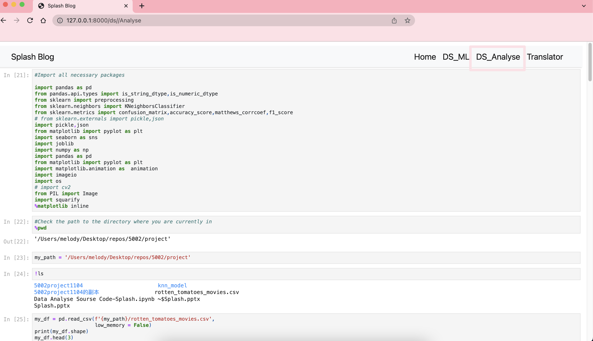
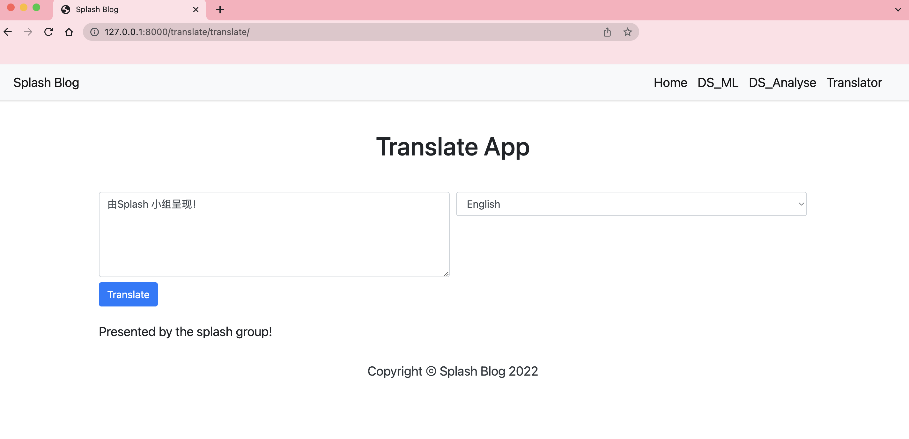

# Splash Blog ——— Movie lovers' community
## Presented by Group 2 Splash
Chen Chen ❤
Xinyi Wei ❤
Yingtong Xu ❤
Yuting Jiang ❤

## Intro

What we build is a Django website which has three features:
 1.It has a blog feature with an admin interface based on Django framework

1.1 log in and out
 1.2 write & save & publish & edit blog-posts to the website
 1.3 embed a personal blog which was implemented through HEXO frame work 1.4 page landscaping

2.The website also has a translator app
 2.1 translate text from one language to another 2.2 choose the target language you want
 2.3 page landscaping

3.We also build a interface to show you our learning results of data science, data visualization, and machine learning.

3.1 Analyse the number of films released each year, calculate each movie type's proportion. Visualise the conclusion.

3.2 Analyse the movie comments' emotional tendency based on NLTK and VADER.
 3.3 Using audience count and movie runtime to predict the audience status (spilled or upright).

## Requirements
python >= 2.5 

pip >= 0.8

django >= 3.2 (tested with Django 1.6 and Django 1.7)

pip install squarify

pip install googletrans==4.0.0-rc1

p.s. The packages that needs to be imported to implement data science, data visualization, and machine learning has been presented in the source code (Data Analyse Sourse Code-Splash.ipynb)

Based on the requirements above, open the whole folder in VScode or PyCharm, our project can be run by inputting "python manage.py runserver" in terminal.

This folder also includes two ipynb files which can be run by evoking jupyter notebook.

## Function
creat new user

user log in

user profile page

visit blog homepage

click here to jump in about page

visit about page

visit data_scienc(ML) page

visit data_scienc(DS) page

visit translate page

## Example for background test super user:
Username: jyt
Password: jyt199969

## Skills
Python
Django
HTML
Machine Learning
Data Analyse

## Contribution
All team members implement our own edition. Help each other debug, code review, discuss, improve, share, prepare for the final presatation.

#### Presented by Group 2 Splash
